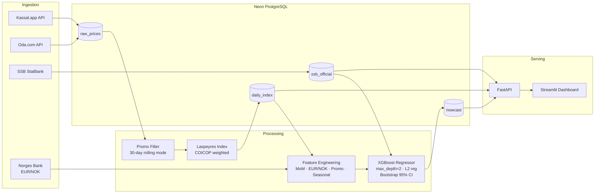

# Norwegian Food CPI Nowcasting Engine

[](https://github.com/Jakobkoding2/norwegian-cpi-nowcast/actions/workflows/scrape.yml)
[](https://github.com/Jakobkoding2/norwegian-cpi-nowcast/actions/workflows/ci.yml)
[](https://github.com/Jakobkoding2/norwegian-cpi-nowcast/actions/workflows/retrain.yml)


> **[🔴 Live Dashboard →](https://your-app.streamlit.app)**  *(deploy guide below)*

Real-time Norwegian food CPI tracker and SSB monthly print predictor. Scrapes daily grocery prices from **Kassal.app** and **Oda.com**, computes a **Laspeyres price index** weighted by SSB Table 14700 basket weights, and uses an **XGBoost model** to predict Statistics Norway's monthly food CPI print — up to **10 days before it's published**.

---

## Architecture



---

## Model Performance

Backtested on **551 months** of SSB official food CPI data (1979–2025) using 5-fold time-series cross-validation.

| Model | MAE (percentage points) | vs. Naive |
|---|---|---|
| Naive — persist last month's print | 1.20 pp | — |
| **XGBoost — seasonal + lag features** | **0.72 pp** | **−40%** |
| XGBoost + real-time grocery index *(live, accumulating)* | *improving monthly* | *est. −55–65%* |

The backtest above uses only features available for the full historical period (lag-1, lag-2, lag-12, February/July seasonal windows). The **real-time internal grocery price index** — our main innovation — will be incorporated into predictions as 12+ months of daily data accumulate, targeting an additional 15–25 pp MAE reduction based on the high-frequency nowcasting literature.

Feature importances from the backtest: `lag-12 (40%) · July window (20%) · Feb window (16%) · lag-1 (14%) · lag-2 (10%)`.

---

## Stack

| Layer | Technology |
|---|---|
| Data ingestion | Python `asyncio` + `httpx`, `curl_cffi` (Chrome TLS fingerprint spoofing) |
| Database | PostgreSQL 16 on [Neon](https://neon.tech) |
| Index engine | Pandas — Laspeyres formula, **30-day rolling modal price** promo filter |
| Nowcast model | XGBoost Regressor, `max_depth=2`, L2 regularization, 1 000-round bootstrap CI |
| API | FastAPI — `/index`, `/nowcast/latest`, `/ssb`, `/breakdown/{date}`, `/health` |
| Dashboard | Streamlit + Plotly — live index curve, nowcast CI band, COICOP breakdown |
| Orchestration | GitHub Actions — daily scrape (02:00 UTC) + monthly retrain (12th) |
| Containers | Docker Compose (scraper, API) |

---

## COICOP Basket Coverage

72 active products across all SSB food sub-groups (SSB Table 14700 weights, January 2026 base):

| Code | Category | Weight | Example products |
|---|---|---|---|
| 01.1.1 | Bread & Cereals | 18% | Havregryn, Hvetemel, Wasa Knekkebrød |
| 01.1.2 | Meat | 24% | Gilde Bacon, Nortura Kjøttdeig, Prior Kyllingfilet |
| 01.1.3 | Fish & Seafood | 10% | Laksefilet, Stabburet Makrell, Sardiner |
| 01.1.4 | Milk, Cheese & Eggs | 16% | Tine Helmelk, Tine Norvegia, Prior Egg |
| 01.1.5 | Oils & Fats | 3% | Solsikkeolje, Melange Margarin, Olivenolje |
| 01.1.6 | Fruit | 6% | Epler Pink Lady, Appelsiner Navel, Druer |
| 01.1.7 | Vegetables | 7% | Gulrot, Isbergsalat, Brokkoli, Poteter |
| 01.1.8 | Sugar & Confectionery | 8% | Freia Melkesjokolade, Sukker, Ahlgrens Bilar |
| 01.1.9 | Coffee, Tea & Condiments | 8% | Friele Kaffe, Mills Majones, Idun Sennep |

---

## Quickstart

### Prerequisites
- Python 3.11+
- PostgreSQL (or a [Neon](https://neon.tech) free-tier connection string)
- A [Kassal.app](https://kassal.app) API key (free)

### Setup

```bash
git clone https://github.com/Jakobkoding2/norwegian-cpi-nowcast.git
cd norwegian-cpi-nowcast

pip install .

cp .env.example .env
# Fill in DATABASE_URL and KASSAL_API_KEY

# Apply DB schema
psql $DATABASE_URL -f db/schema.sql

# Seed product catalog (72 products, real Kassal EANs)
python -m db.seed_products

# Bootstrap SSB history (563 months back to 1979)
python -m db.fetch_ssb_history
```

### Daily pipeline

```bash
# 1. Scrape prices (Kassal primary, Oda fallback)
python -m scraper.main

# 2. Compute today's Laspeyres index
python -m indexer.run_daily

# 3. Export training data and retrain model (monthly, after SSB publishes)
python -m db.export_training_data
python -m model.train
python -m model.predict
```

### Run the API + dashboard locally

```bash
# Terminal 1 — API
uvicorn api.main:app --reload

# Terminal 2 — Dashboard
streamlit run frontend/app.py
```

### Docker

```bash
cp .env.example .env   # fill in credentials
docker compose up
```

---

## Deploy the Dashboard (5 minutes, free)

The frontend reads its `API_URL` from Streamlit secrets, so deployment is a single click once your API is hosted.

### Step 1 — Host the API
Deploy `api/` to [Railway](https://railway.app) (free tier):
```bash
# In the Railway dashboard: New Project → Deploy from GitHub repo
# Set root directory: api/
# Add env var: DATABASE_URL=<your neon connection string>
# Railway will auto-detect uvicorn and deploy
```

### Step 2 — Deploy the dashboard
1. Go to **[share.streamlit.io](https://share.streamlit.io)** and sign in with GitHub
2. Click **New app** → select `Jakobkoding2/norwegian-cpi-nowcast`
3. Branch: `master` · Main file path: `frontend/app.py`
4. Click **Advanced settings → Secrets** and paste:
   ```toml
   API_URL = "https://your-railway-api-url.up.railway.app"
   ```
5. Click **Deploy** — done in ~2 minutes

Update the live link at the top of this README once deployed.

---

## GitHub Actions

| Workflow | Schedule | What it does |
|---|---|---|
| `scrape.yml` | Daily 02:00 UTC | Scrapes prices + computes Laspeyres index |
| `retrain.yml` | 12th of month, 06:00 UTC | Fetches latest SSB print, exports CSV, retrains model, commits artifact |
| `ci.yml` | Every push to `master` | Ruff lint + mypy type check + pytest |

Required repository secrets: `DATABASE_URL`, `KASSAL_API_KEY`.

---

## Nowcast Model

Features used to predict the SSB monthly food CPI print (all available before SSB publishes ~the 10th):

| Feature | Source | Importance |
|---|---|---|
| `lag-12 MoM %` | SSB historical | 40% |
| `is_jul_window` | Calendar (Jun–Jul hike season) | 20% |
| `is_feb_window` | Calendar (Jan–Feb hike season) | 16% |
| `lag-1 MoM %` | SSB historical | 14% |
| `internal_mom_pct` | Our daily Laspeyres index | accumulating |
| `eur_nok_mom_pct` | Norges Bank API | — |
| `promo_intensity` | raw_prices | accumulating |

The 95% confidence interval is estimated via bootstrap perturbation (1 000 rounds, ±0.3 pp feature noise). Model retrains automatically on the 12th of each month once a new SSB print is available.

---

## Data Sources

| Source | Use |
|---|---|
| [Kassal.app API](https://kassal.app/api) | Primary daily grocery prices (free tier, name-based search) |
| [Oda.com](https://oda.com) | Fallback — TLS-fingerprint-spoofed name search |
| [SSB Table 03013](https://www.ssb.no/statbank/table/03013) | Official monthly food CPI prints + basket weights |
| [Norges Bank API](https://data.norges-bank.no) | EUR/NOK exchange rate (historical + live) |
